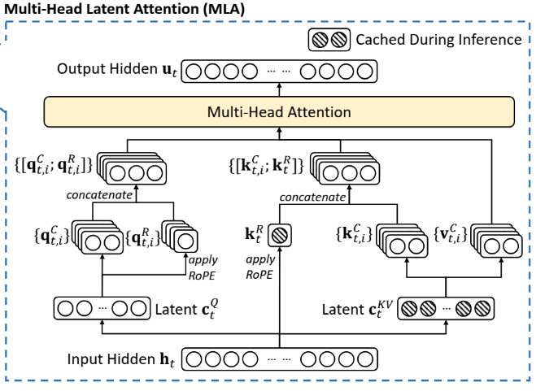

- 区分:嵌入应该是专门的嵌入层查表,所以形状是(vocabsize,dim)
- 最后的output应该是映射回去(dim,vocabsize)

开始的嵌入和最后的权重共享:可以做也可以不做

register_buffer:注册跟随模型但是不参与训练的参数

RMSnorm:
$$
\text{output}=\gamma \times \frac{x}{std}
$$

# norm and init
norm能够确实能够把激活值的方差拉回来            
但是好的init仍然需要
- 初始化能够设置模型开始训练的时候的optimization
- 反向传播的时候的梯度还是会受到影响

对残差连接的网络
$$
\text{Var}(x_{L+1})=\text{Var}(x_l+f_l)\approx \text{Var}(x_l)+\text{Var}(f_l)=\text{Var}(x_0)+(L+1)\text{Var}(f_l)
$$

所以我们不可能保持方差完全不变,只能通过控制初始化与layer层相关来将out variance控制在比开始多一个常数的范围

# MLA(multihead-latent attention)
arithmetic intensity=FLOPS/IO
e.g:h100的该参数大概是接近600,这意味着我们每load一个byte就需要进行约600次计算,否则就会under utilize

- prefill的时候每次是输入生成一大堆
- decode的时候只输入生成一个token的概率分布,计算量少的同时还是要加载所有参数,所以比较而言很IO bound

$$
\frac{1}{\text{arithmetic intensity}}=\Theta (\frac{lm^2d+md^2}{lmd^2})=\Theta (\frac{1}{l}+\frac{m}{d})
$$
我们想要让它尽可能小    
要么增大l(batch)    
要么增大d(token向量的维度)      
要么减小m(seqlen)   

## MQA and GQA
dim可以表示为注意力头数乘每个头的维数
$$
d=d_{head}\times n
$$

- 原本的多头注意力每个头都有Q,K,V     
- MQA选择将这里的num_head设置为1(实际上是不同Query head共享相同的KV,这样load更少,但是计算量相同)        
- 很明显会导致性能下降        

- GQA选择折衷
- 每一组的query head使用相同的KV head

## MLA

[结合代码理解](../torchfeather/model/model.py)